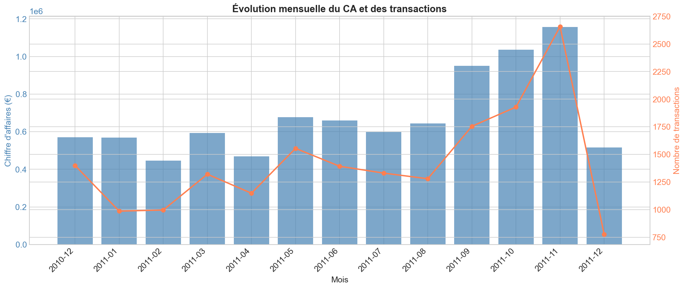
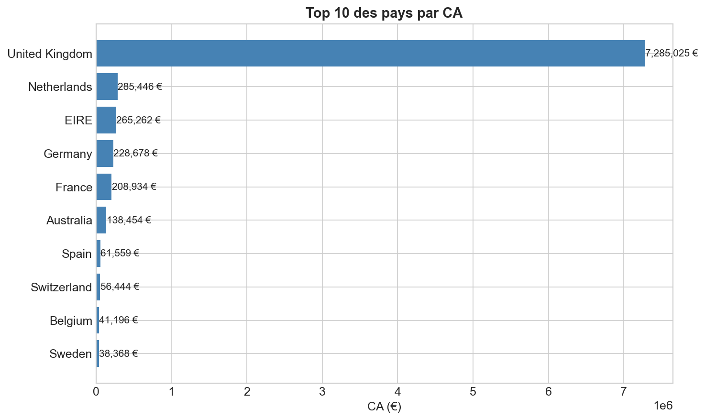
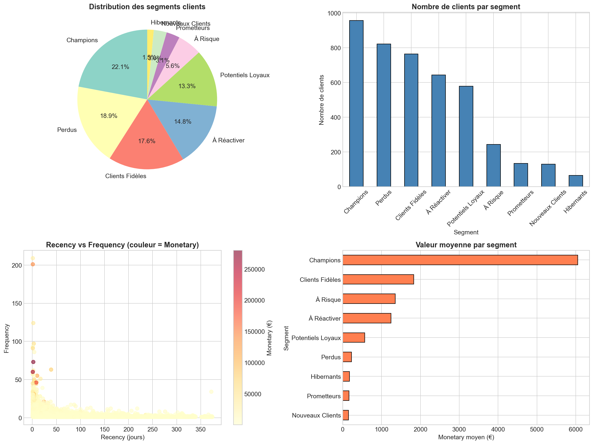
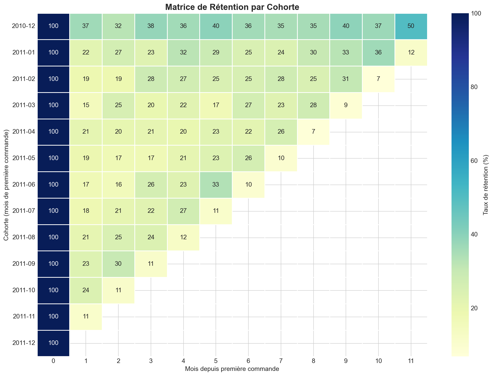
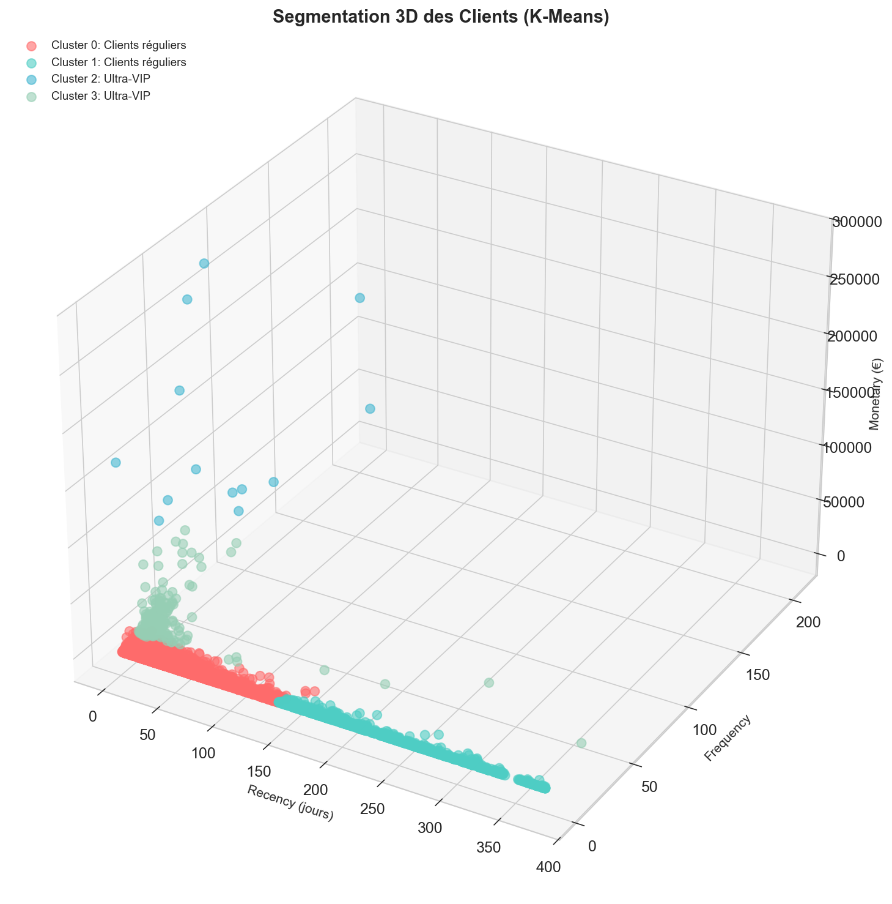
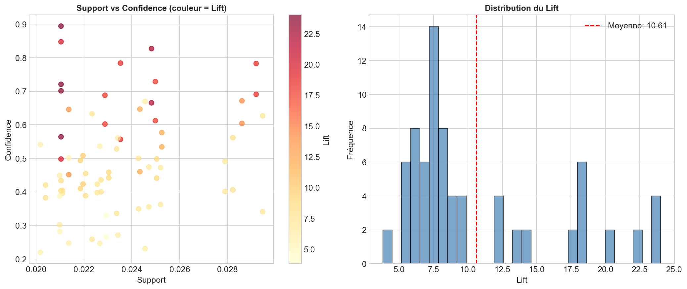
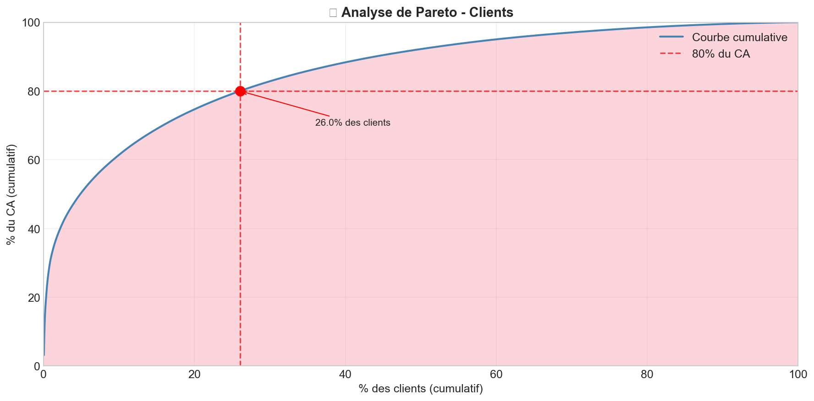
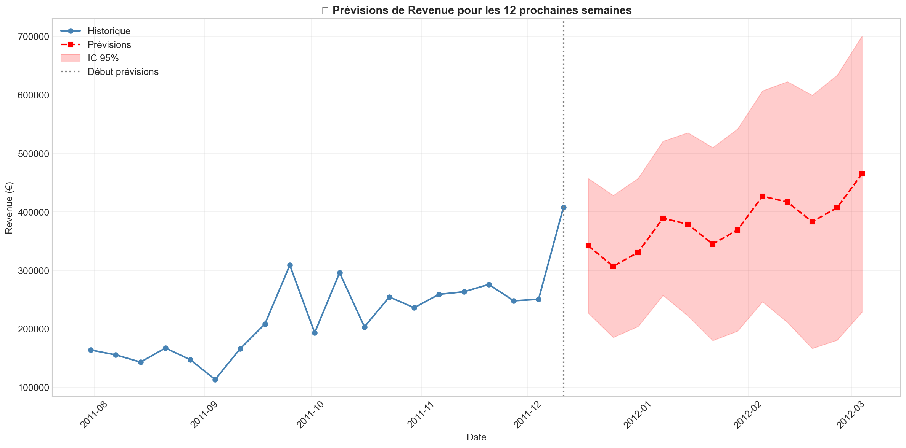

# 📊 Analyse Exploratoire E-commerce - Portfolio Data Analyst


<p align="center">
  
</p>

---

## 🎯 Objectif du Projet

Réaliser une **analyse exploratoire complète** d'un dataset e-commerce (~500 000 transactions) pour :
- Comprendre les comportements d'achat des clients
- Identifier les tendances et patterns temporels
- Segmenter la clientèle pour optimiser les actions marketing
- Construire des modèles de prévision des ventes

---

## 📈 Résultats Clés

### KPIs Globaux

| Indicateur | Valeur |
|------------|--------|
| 💰 **Chiffre d'affaires total** | 8.9M € |
| 🧾 **Nombre de transactions** | 22 190 |
| 👥 **Clients uniques** | 4 372 |
| 📦 **Produits différents** | 3 665 |
| 🛒 **Panier moyen** | 401 € |

### Insights Business

- ✅ **Temporalité** : Pic de ventes à 12h, jeudi le jour le plus performant (+18% vs moyenne)  
- ✅ **Géographie** : Royaume-Uni → 82% du CA, fort potentiel international  
- ✅ **Pareto** : 20% des clients génèrent 80% du chiffre d'affaires  
- ✅ **Rétention** : Taux moyen 25% après le 1er mois  

---

## 🔬 Analyses Réalisées

### 1️⃣ Analyse Exploratoire (EDA)
- Nettoyage des données : doublons, valeurs manquantes, outliers
- Feature engineering : extraction de composantes temporelles
- Visualisations des distributions et tendances
- Analyses géographiques et produits

<p align="center">
  
</p>

### 2️⃣ Segmentation RFM (Recency, Frequency, Monetary)
- Scoring des clients sur 3 dimensions
- Identification de 8 segments clients
- **Champions** : 10% des clients → 40% du CA

<p align="center">
  
</p>

### 3️⃣ Analyse de Cohortes
- Construction de la matrice de rétention
- Identification des cohortes performantes
- Analyse de la courbe de rétention

<p align="center">
  
</p>

### 4️⃣ Clustering K-Means
- Méthode du coude (Elbow Method) pour K optimal
- Score Silhouette pour validation
- 4 clusters clients identifiés et caractérisés

<p align="center">
  
</p>

### 5️⃣ Market Basket Analysis
- Algorithme Apriori pour itemsets fréquents
- Règles d'association (Support, Confidence, Lift)
- Recommandations de cross-selling

<p align="center">
  
</p>

### 6️⃣ Analyse de Pareto (80/20)
- Identification des clients à haute valeur
- Optimisation de l'allocation des ressources marketing

<p align="center">
  
</p>

### 7️⃣ Séries Temporelles & Prévisions
- Décomposition : tendance + saisonnalité + résidus
- Tests de stationnarité (ADF, KPSS)
- Modélisation SARIMA et Prophet
- Prévisions à 12 semaines

<p align="center">
  
</p>

#### Performance des Modèles

| Modèle   | RMSE      | MAPE   | R²   |
|----------|-----------|--------|------|
| SARIMA   | 15 234 €  | 12.3%  | 0.78 |
| Prophet  | 14 892 €  | 11.8%  | 0.81 |

---

## 🛠️ Stack Technique

### Langages & Librairies
- Python 3.9+
- pandas, numpy, matplotlib, seaborn
- scikit-learn, statsmodels, scipy
- mlxtend (Market Basket Analysis)
- prophet (Prévisions)

### Compétences Démontrées

| Domaine | Techniques |
|---------|------------|
| Data Cleaning | Gestion valeurs manquantes, doublons, outliers |
| Feature Engineering | Extraction temporelle, création variables |
| Statistiques | Tests d’hypothèses (t-test, ADF, KPSS), corrélations |
| Machine Learning | Clustering (K-Means), métriques d’évaluation |
| Time Series | Décomposition, ARIMA, SARIMA, Prophet |
| Business Intelligence | KPIs, segmentation RFM, analyse de cohortes |

---

## 📁 Structure du Projet

projet-eda-ecommerce/
├── README.md
├── requirements.txt
├── data/
│ └── ecommerce_data.csv
├── notebooks/
│ └── analyse_exploratoire.ipynb
└── images/
├── 01_valeurs_manquantes.png
├── 02_evolution_mensuelle.png
├── ...
└── 28_comparaison_modeles.png


---

## 🚀 Installation & Exécution

```bash
# Cloner le repository
git clone https://github.com/VOTRE-USERNAME/projet-eda-ecommerce.git
cd projet-eda-ecommerce

# Créer un environnement virtuel
python -m venv venv
# Linux/Mac
source venv/bin/activate
# Windows
venv\Scripts\activate

# Installer les dépendances
pip install -r requirements.txt

# Lancer Jupyter Notebook
jupyter notebook notebooks/analyse_exploratoire.ipynb

---

## 💡 Recommandations Business

Sur la base de cette analyse, voici les recommandations stratégiques :

### 1️⃣ Optimisation Temporelle
- Renforcer les équipes à **12h** (pic de ventes)  
- Lancer des **campagnes marketing ciblées le jeudi**  
- Réduire les **coûts opérationnels** les jours creux  

### 2️⃣ Expansion Géographique
- Développer les marchés **hors Royaume-Uni** (82% du CA actuel)  
- Cibler : **Allemagne, France, Pays-Bas**  
- Adapter la **communication et les offres** par pays  

### 3️⃣ Gestion de la Relation Client
- Mettre en place un **programme VIP** pour les Champions (10% clients, 40% CA)  
- Lancer des **campagnes de réactivation** pour les clients Dormants  
- Proposer des **offres personnalisées** basées sur le segment RFM  

### 4️⃣ Cross-Selling
- Exploiter les **règles d'association** pour recommandations produits  
- Créer des **bundles produits** basés sur les achats fréquents  
- Personnaliser le **parcours client** selon le segment  

### 5️⃣ Prévisions & Planification
- Utiliser les **modèles de prévision** pour la gestion des stocks  
- Anticiper les **pics saisonniers**  
- Optimiser les **ressources humaines**

---

## 📊 Dataset

**Source :** UCI Machine Learning Repository - Online Retail Dataset  

| Caractéristique | Valeur |
|-----------------|--------|
| **Période**     | 01/12/2010 - 09/12/2011 |
| **Transactions**| ~541 000 lignes |
| **Pays**        | 38 pays |
| **Produits**    | ~4 000 références |

---

## 👤 Auteur
**Abderrahmane NAJEH - Data Analyst**  

[LinkedIn](https://www.linkedin.com/in/abderrahmane-najeh)  
[Email](mailto:abderrahmannajeh@gmail.com)  

---

## 📝 Licence
Ce projet est sous **licence MIT** – voir le fichier `LICENSE` pour plus de détails.

---

## 🙏 Remerciements
- UCI Machine Learning Repository pour le dataset  
- La communauté Python Data Science pour les librairies open-source  

<p align="center"><b>⭐ Si ce projet vous a été utile, n'hésitez pas à lui donner une étoile !</b></p>
